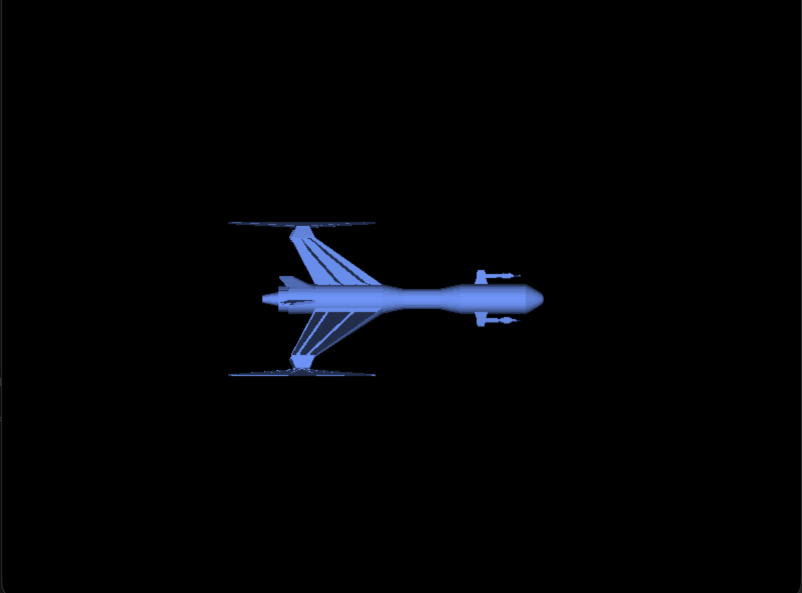

# Spaceship 3D Renderer - Proyecto 3

## Descripción del Proyecto

Este proyecto implementa un renderizador 3D por software que carga y renderiza un modelo de nave espacial desde un archivo OBJ. El proyecto está basado en Rust y utiliza rasterización manual de triángulos para mostrar el modelo 3D en pantalla.

## Características Implementadas

- **Carga de modelos OBJ**: Utiliza la librería `tobj` para cargar modelos 3D desde archivos .obj
- **Rasterización de triángulos**: Implementación manual de rasterización usando coordenadas baricéntricas
- **Transformaciones 3D**: Matrices de transformación para traslación, rotación y escalado
- **Z-buffer**: Sistema de profundidad para renderizado correcto de superficies ocultas
- **Shading básico**: Iluminación difusa simple con una fuente de luz direccional
- **Controles interactivos**: Movimiento, rotación y escalado del modelo en tiempo real

## Estructura del Código

El proyecto está organizado en los siguientes módulos:

- `main.rs`: Bucle principal, manejo de eventos y lógica de renderizado
- `framebuffer.rs`: Buffer de píxeles y z-buffer para el renderizado
- `triangle.rs`: Rasterización de triángulos usando coordenadas baricéntricas
- `vertex.rs`: Estructura de vértices con posición, normal y coordenadas de textura
- `obj.rs`: Cargador de archivos OBJ
- `color.rs`: Estructura para manejo de colores RGB
- `fragment.rs`: Estructura para fragmentos rasterizados
- `shaders.rs`: Vertex shader para transformaciones de vértices

## Controles

- **Flechas**: Mover el modelo
- **S/A**: Escalar (aumentar/disminuir tamaño)
- **Q/W**: Rotar en eje X
- **E/R**: Rotar en eje Y  
- **T/Y**: Rotar en eje Z
- **ESC**: Salir del programa

## Implementación del Renderizado

El proceso de renderizado sigue el pipeline gráfico estándar:

1. **Vertex Shader**: Transforma cada vértice usando matrices de transformación
2. **Primitive Assembly**: Agrupa vértices en triángulos
3. **Rasterización**: Convierte triángulos en fragmentos usando coordenadas baricéntricas
4. **Fragment Processing**: Aplica iluminación y colores a cada píxel

### Rasterización Manual de Triángulos

La función de rasterización implementa:
- Cálculo de bounding box para optimización
- Coordenadas baricéntricas para determinar si un píxel está dentro del triángulo
- Interpolación de profundidad para z-buffer
- Cálculo de iluminación difusa usando normales

## Requisitos del Sistema

- Rust 1.70 o superior
- Cargo (incluido con Rust)

## Dependencias

```toml
minifb = "0.27"      # Para crear ventana y mostrar píxeles
nalgebra-glm = "0.19" # Matemáticas vectoriales y matriciales
tobj = "4.0"         # Carga de archivos OBJ
```

## Compilación y Ejecución

```bash
cargo build --release
cargo run
```

## Modelo Utilizado

El proyecto incluye un modelo de nave espacial (`Spaceship.obj`) con:
- 17,664 vértices
- Geometría compleja con múltiples superficies
- Normales calculadas para iluminación

## Resultado Visual

El modelo se renderiza en color amarillo (como especificado en la asignación) con iluminación difusa que proporciona profundidad visual. El modelo aparece centrado en pantalla con un tamaño apropiado que permite ver todos los detalles sin salirse de los límites de la ventana.



## Técnicas Implementadas

- **Coordenadas baricéntricas**: Para determinar si un píxel está dentro de un triángulo
- **Z-buffer**: Para manejo correcto de superficies ocultas  
- **Transformaciones matriciales**: Rotación, traslación y escalado
- **Iluminación difusa**: Usando producto punto entre normal y dirección de luz
- **Rasterización optimizada**: Usando bounding boxes para reducir píxeles procesados

Este proyecto demuestra los fundamentos del renderizado 3D implementados desde cero, proporcionando una base sólida para entender cómo funcionan los motores gráficos modernos.
